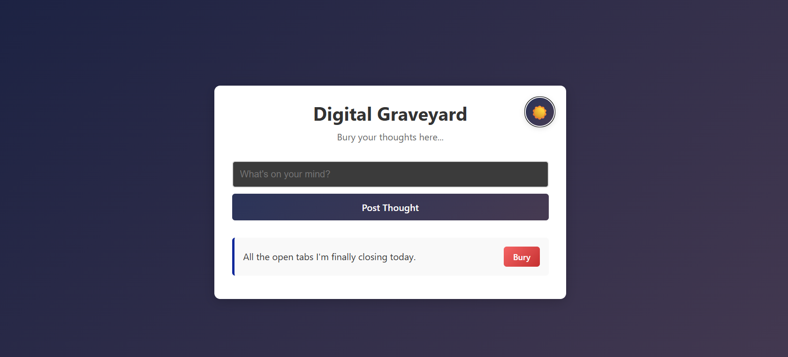

# 🪦 Digital Graveyard - MERN Stack App

A full-stack MERN (MongoDB, Express, React, Node.js) application where you can "bury" your thoughts. This project demonstrates CRUD operations, theme switching, and modern web development practices.



## ✨ Features

- 📝 **Create Thoughts** - Post your thoughts to the digital graveyard
- 👀 **Read Thoughts** - View all your buried thoughts in chronological order
- 🗑️ **Delete Thoughts** - Bury (delete) thoughts permanently
- 🌓 **Theme Toggle** - Switch between dark and light themes
- 📱 **Responsive Design** - Works seamlessly on all devices
- 🎨 **Modern UI** - Beautiful gradients and smooth animations
- ⚡ **Real-time Updates** - Instant feedback on all operations

## 🛠️ Tech Stack

### Frontend
- **React** - UI library
- **Vite** - Build tool and dev server
- **CSS3** - Styling with gradients and animations

### Backend
- **Node.js** - Runtime environment
- **Express.js** - Web framework
- **MongoDB** - NoSQL database
- **Mongoose** - MongoDB object modeling

## 📁 Project Structure

```
Digital-Graveyard/
├── backend/
│   ├── server.js          # Express server & API routes
│   ├── .env               # Environment variables
│   └── package.json       # Backend dependencies
├── frontend/
│   ├── src/
│   │   ├── App.jsx        # Main React component
│   │   ├── App.css        # Styling
│   │   └── main.jsx       # React entry point
│   ├── index.html         # HTML template
│   └── package.json       # Frontend dependencies
└── README.md
```

## 🚀 Getting Started

### Prerequisites

- Node.js (v14 or higher)
- MongoDB Atlas account (or local MongoDB)
- npm or yarn

### Installation

1. **Clone the repository**
   ```bash
   git clone https://github.com/prashantchauhan-12/Personal-Thought-GraveYard-MERN.git
   cd Personal-Thought-GraveYard-MERN
   ```

2. **Setup Backend**
   ```bash
   cd backend
   npm install
   ```

3. **Configure Environment Variables**
   
   Create a `.env` file in the `backend` folder:
   ```env
   mongo_url=your_mongodb_connection_string
   ```

4. **Setup Frontend**
   ```bash
   cd ../frontend
   npm install
   ```

### Running the Application

1. **Start the Backend Server**
   ```bash
   cd backend
   npm run dev
   ```
   Server will run on `http://localhost:5000`

2. **Start the Frontend (in a new terminal)**
   ```bash
   cd frontend
   npm run dev
   ```
   App will run on `http://localhost:5173`

3. **Open your browser** and navigate to `http://localhost:5173`

## 🎯 API Endpoints

| Method | Endpoint | Description |
|--------|----------|-------------|
| GET | `/thoughts` | Get all thoughts |
| POST | `/thoughts` | Create a new thought |
| DELETE | `/thoughts/:id` | Delete a thought by ID |

## 🎨 Features Breakdown

### Theme Switching
- Toggle between dark and light themes
- Smooth color transitions
- Persistent theme preference (can be extended with localStorage)

### CRUD Operations
- **Create**: Add new thoughts via input field
- **Read**: Display all thoughts in reverse chronological order
- **Update**: Not implemented (can be added as enhancement)
- **Delete**: Remove thoughts with the "Bury" button

### Responsive Design
- Flexbox layout for perfect centering
- Scrollable container when content overflows
- Mobile-friendly interface

## 🔧 Configuration

### MongoDB Setup
1. Create a MongoDB Atlas account at [mongodb.com](https://www.mongodb.com/cloud/atlas)
2. Create a new cluster
3. Get your connection string
4. Add it to the `.env` file in the backend folder

### DNS Configuration (for MongoDB Atlas)
The backend includes DNS configuration for better MongoDB Atlas connectivity:
```javascript
dns.setDefaultResultOrder('ipv4first');
dns.setServers(['8.8.8.8', '8.8.4.4']);
```

## 🎓 Learning Objectives

This project is perfect for learning:
- Full-stack MERN development
- RESTful API design
- React state management
- MongoDB CRUD operations
- CSS animations and theming
- Environment variable configuration

## 🚧 Future Enhancements

- [ ] Edit functionality for thoughts
- [ ] Search and filter thoughts
- [ ] User authentication
- [ ] Thought categories/tags
- [ ] Export thoughts to JSON/CSV
- [ ] Timestamps ("2 hours ago" format)
- [ ] Character counter
- [ ] Markdown support
- [ ] Sound effects
- [ ] LocalStorage for theme persistence

## 🤝 Contributing

Contributions, issues, and feature requests are welcome!

## 👨‍💻 Author

**Prashant Chauhan**
- GitHub: [@prashantchauhan-12](https://github.com/prashantchauhan-12)

## 🙏 Acknowledgments

- Inspired by the need for a simple thought management app
- Built for learning and revision purposes
- Thanks to the MERN stack community

---

⭐ Star this repo if you found it helpful!
